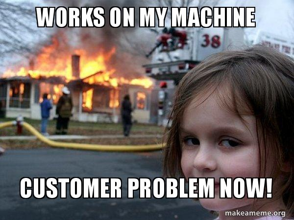
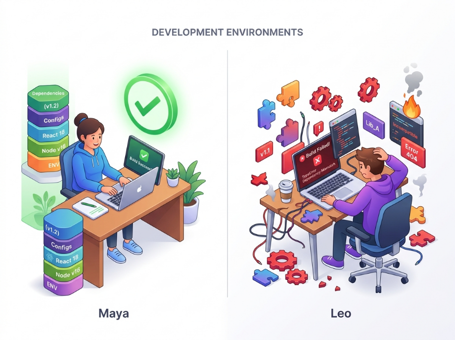
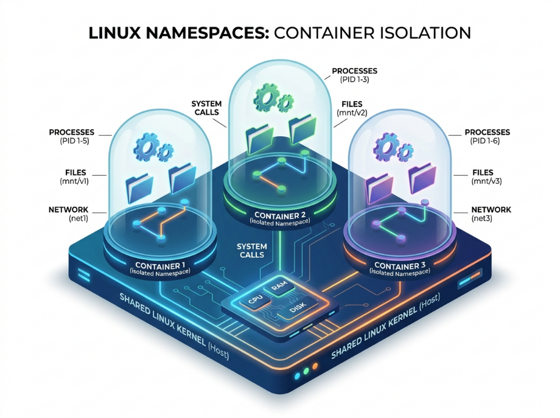

---

<h1 align=center>Inception</h1>

---
<p align=center>
	
</p>

Before taking your first step into learning containerization, you gonna take hours and days struggling **where** to start and **what** to learn first!  
You gonna find a lot of keywords like containers, Docker, dockerfiles, images, volumes, daemon, commands etc.   
what is the first step i should take exactly?  

**THIS IS WHY AM HERE!**  Am gonna make it easy for you don't worry.    

# Containerization, Containers and Docker
## Introduction
Those are the first keyword you should understand before starting anything else.  
You need to understand the fundamentals. What are those keywords means ?? and what is the difference between them? and why we use them? What is the problem they came to solve ??  

> I hope you ask yourself a **lot** of questions while learning phase, this is the real software engineer mentality, the one who keep asking repeatedly **WHY? HOW? WHAT? ...?** 

Lets give the general difference between them before going deeply for each:  
+ **Containerization :** The technique;  
+ **Container :** An isolated environment created using that technique;  
+ **Docker :** Tool that make creating container easy.  

A docker container is not a tiny virtual machine, it is just a normal linux process that has been isolated using linux features we gonna talk about later.   

Now lets go a little bit deeper explaining each one!  

## Containerization
<p align=center>
	
</p>

### Problematic
Image you are developing a full stack application which use some specific :  
```js
node 25
library X (works only in linux)
library Y
configuration X
configuration Y
etc...
```

You want the help of another developer, you should give him your code, but on his machine he have the `windows OS` and :   
```js
node 18
library A
library B
etc...
```

The application gonna crash on his machine, because he don't have all the dependencies your application needs to run correctly.   

This is the classic problem : **IT WORKS ON MY MACHINE!**   
<p align=center>
	
</p>

You may think why not using a virtual machine which contain all the dependencies of the application to run and work?  

VMs are soooo **heavy**, each one contain an entire operating system.  

### Definition
Containerization is the **concept, methodology and strategy** of packaging the application with all its runtime environment including the necessary dependencies, system libraries and configuration files, so the application can runs **uniformly** and **consistently** across any infrastructure, and without using another OS like the VMs does.  

All the containers shares the host's kernel, we don't need an independent OS for every container, and that's why the containers are waaaay ligher that the VMs   

```js
                 HOST
┌──────────────────────────────────────┐
│                                      │
│             Linux Kernel             │
│                                      │
│   ┌────────────┐   ┌────────────┐    │
│   │ Container  │   │ Container  │    │
│   │            │   │            │    │
│   │ filesystem │   │ filesystem │    │
│   │ namespace  │   │ namespace  │    │
│   │ cgroup     │   │ cgroup     │    │
│   │            │   │            │    │
│   │ nginx      │   │ postgres   │    │
│   └────────────┘   └────────────┘    │
│                                      │
└──────────────────────────────────────┘
```

So Containerization is the process of creating a container, and when we say process we don't mean a linux running process, we mean the steps we pass from so the container need to be created.   

### How it works
We already know the container use the same host's kernel, then why doesn't containers see each other files ? and one a container can't take all the CPU memory?  

The isolation is achived using mainly two **linux** features which make boundries for each container :  
#### namespaces (who can see what?)
namespaces give a process its own isolated view of some system resource, its the one responsible of what a container can see, namespaces separate:  
+ Processes: each container see only its own processes;  
+ Files: each container see its own filesystem;  
+ Network: each container has its own IP;  
+ Users: permissions are separated.
<p align=center>
	
</p>

There are several types of namespaces :  
+ **PID namespace :** 