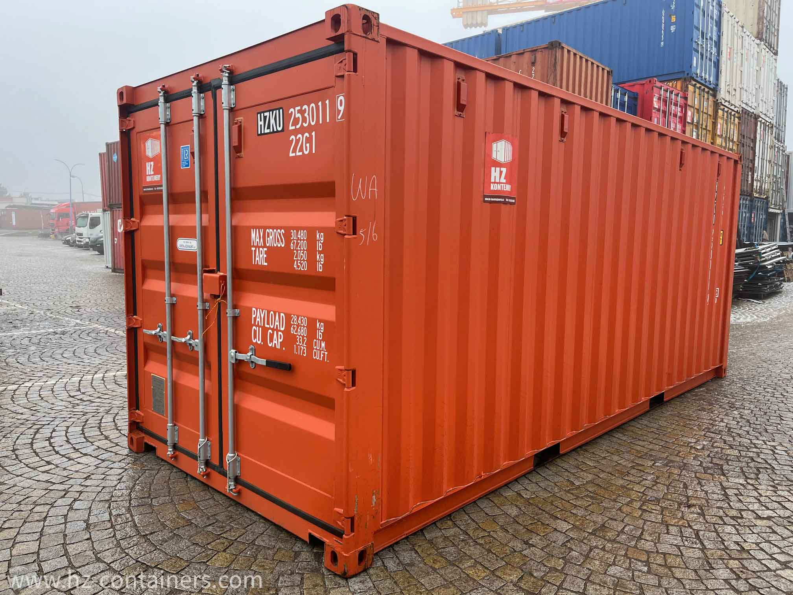
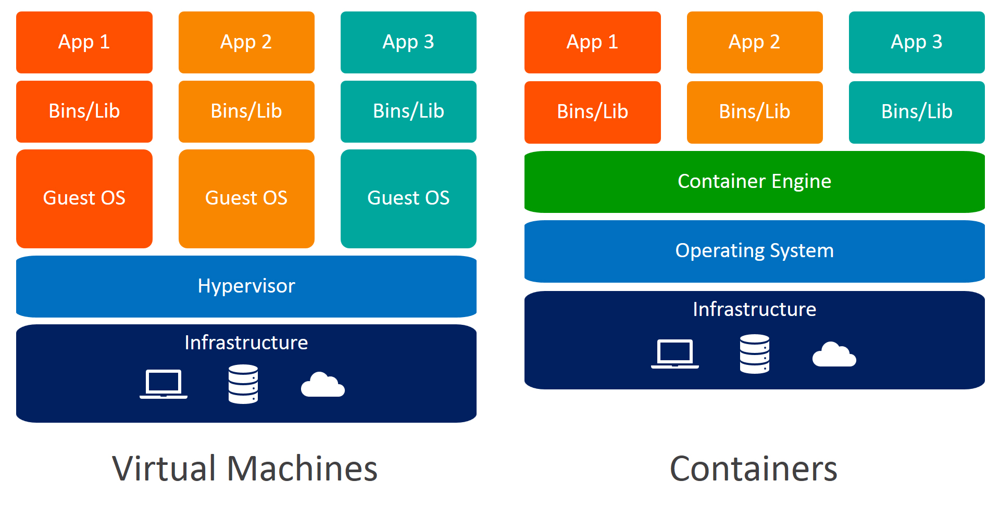
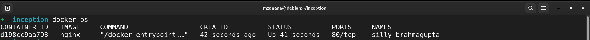
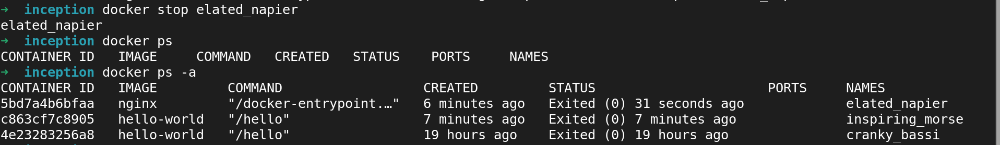
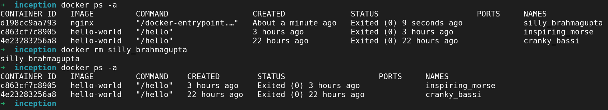
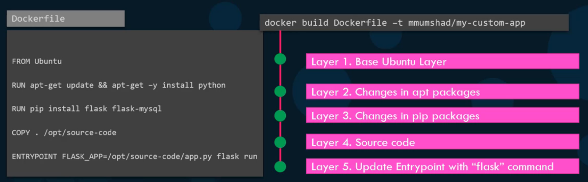
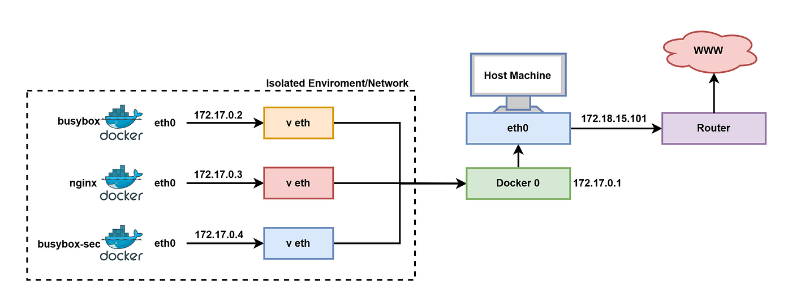
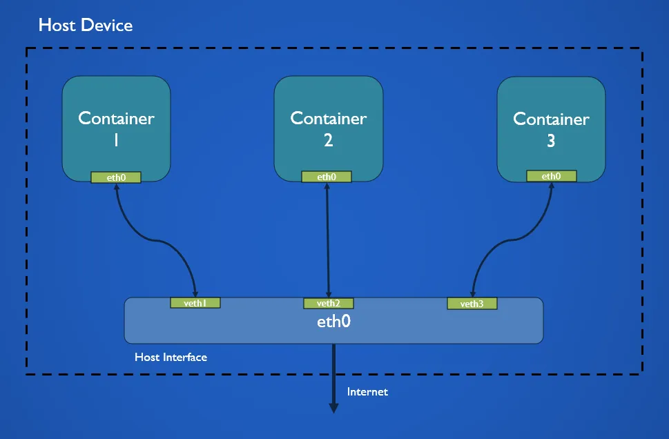
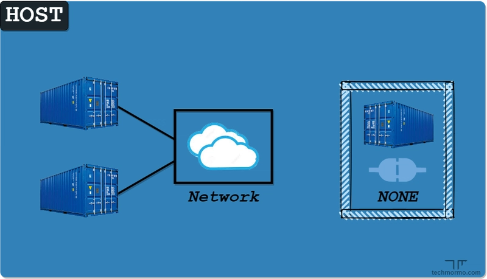

---

<h1 align=center>Inception</h1>

---
<p align=center>
	
</p>

Before taking your first step into learning containerization, you gonna take hours and days struggling **where** to start and **what** to learn first!  
You gonna find a lot of keywords like containers, Docker, dockerfiles, images, volumes, daemon, commands etc.   
what is the first step i should take exactly?  

**THIS IS WHY AM HERE!**  Am gonna make it easy for you don't worry.    

# Containerization, Container
## Introduction
Those are the first keyword you should understand before starting anything else.  
You need to understand the fundamentals. What are those keywords means ?? and what is the difference between them? and why we use them? What is the problem they came to solve ??  

> I hope you ask yourself a **lot** of questions while learning phase, this is the real software engineer mentality, the one who keep asking repeatedly **WHY? HOW? WHAT? ...?** 

Lets give the general difference between them before going deeply for each:  
+ **Containerization :** The technique;  
+ **Container :** An isolated environment created using that technique;  
+ **Docker :** Tool that make creating container easy.  

A docker container is not a tiny virtual machine, it is just a normal linux process that has been isolated using linux features we gonna talk about later.   

Now lets go a little bit deeper explaining each one!  

## Containerization
<p align=center>
	
</p>

### Problematic
Image you are developing a full stack application which use some specific :  
```js
node 25
library X (works only in linux)
library Y
configuration X
configuration Y
etc...
```

You want the help of another developer, you should give him your code, but on his machine he have the `windows OS` and :   
```js
node 18
library A
library B
etc...
```

The application gonna crash on his machine, because he don't have all the dependencies your application needs to run correctly.   

This is the classic problem : **IT WORKS ON MY MACHINE!**   
<p align=center>
	
</p>

You may think why not using a virtual machine which contain all the dependencies of the application to run and work?  

VMs are soooo **heavy**, each one contain an entire operating system.  

### Definition
Containerization is the **concept, methodology and strategy** of packaging the application with all its runtime environment including the necessary dependencies, system libraries and configuration files, so the application can runs **uniformly** and **consistently** across any infrastructure, and without using another OS like the VMs does.  

All the containers shares the host's kernel, we don't need an independent OS for every container, and that's why the containers are waaaay lighter that the VMs   

```js
                 HOST
┌──────────────────────────────────────┐
│                                      │
│             Linux Kernel             │
│                                      │
│   ┌────────────┐   ┌────────────┐    │
│   │ Container  │   │ Container  │    │
│   │            │   │            │    │
│   │ filesystem │   │ filesystem │    │
│   │ namespace  │   │ namespace  │    │
│   │ cgroup     │   │ cgroup     │    │
│   │            │   │            │    │
│   │ nginx      │   │ postgres   │    │
│   └────────────┘   └────────────┘    │
│                                      │
└──────────────────────────────────────┘
```

So Containerization is the process of creating a container, and when we say process we don't mean a linux running process, we mean the steps we pass from so the container need to be created.   

### How it works
We already know the container use the same host's kernel, then why doesn't containers see each other files ? and one a container can't take all the CPU memory?  

The isolation is achieved using mainly  two **linux** features which make boundries for each container :  
#### namespaces (what a container can see?)
namespaces give a process its own isolated view of some system resource, its the one responsible of what a container can see, namespaces separate:  
+ Processes: each container see only its own processes;  
+ Files: each container see its own filesystem;  
+ Network: each container has its own IP;  
+ Users: permissions are separated.  
<p align=center>
	
</p>

There are several types of namespaces :  
+ **PID namespace :** controls what a container can see;  
+ **Mount namespace :** controls what filesystems a process can see;  
+ **Network namespace :** Each container can get its own IP address, routing table, ports. therefore the container can have its own network environment;  

So this is how namespaces provide isolation :  
```js
					Linux Kernel
                         │
        ┌────────────────┼────────────────┐
        │                │                │
        ▼                ▼                ▼

      HOST          Container A       Container B

    processes         processes         processes
    network           network           network
    filesystem        filesystem        filesystem
```


#### CGROUPS (How much a container can use)
```js
                    HOST
                      │
                ┌─────┴─────┐
                │           │
           Container A  Container B
             512 MB        2 GB
             2 CPU         4 CPU
```

CGROUPS stands for Control Groups which decide how much resources a container can use, resources could be CPU, RAM or DISK I/O.   

So even if a container misbehaves or the app has memory leak the system gonna be safe.    

## Container
### Definition
<p align=center>
	
</p>

A container is the isolated execution environment created and configured using containerization mechanisms.  
### Visualization

```js
						                CONTAINER
						┌─────────────────────────────────┐
						│                                 │
						│  Filesystem                     │
						│  Network namespace              │
						│  PID namespace                  │
						│  Mount namespace                │
						│  User namespace                 │
						│  cgroup                         │
						│  capabilities                   │
						│  security configuration         │
						│                                 │
						│       Processes                 │
						│       ├── PID 1 → nginx         │
						│       ├── PID 7 → worker        │
						│       └── PID 8 → worker        │
						│                                 │
						└─────────────────────────────────┘
						                 │
						                 │ shares
						                 ▼
						          HOST LINUX KERNEL
```

### Containers vs VMs
<p align=center>
	
</p>

+ **Containers :**  All the containers share the same host's OS, which make all the containers lightweight and are usualy in MegaBytes, this allows docker containers to boot up faster in matter of seconds

+ **Virtual Machinnes :** Each VM has its own OS inside it, which cause higher utilization of underlying resources as there are multiple operating systems and kernels running, and also VMs consume large space in GigaBytes, also it takes minutes to boot up

# Docker

## Definition
<p align=center>
	
</p>

Docker is an open platform for developing, shipping, and running applications. It's a software that make containerization easier.  
Docker provides mechanisms for building container images, creating, running, networking, storing and managing containers underlying container runtimes.  

The main purpose of docker is to package and containerize applications, and to ship them anywhere, anytime as many times as you want.   

## How it is done
There is a lot of containerized versions of applications available, most organizations have theire own containerized and available in public docker repository called **Docker Hub** or **Docker Store**, we can find images of most operating systems, databases and other services and tools, to run an instance of debian you need just to type in the command line after installing docker on the host machine :   
`docker run debian`   

## Docker Editions
### Entreprise Edition
Entreprise edition is the certified and supported container platform that comes with image management, image security and other features. And this is a **paid** edition.   

### Community Edition
Community edition is the set of the free Docker products, ideal for individual developers, students and small teams.

## Docker Commands
### docker run
`docker run <docker_image>` command is used to run a container from an image, when using `docker run nginx` :  
+ It looks if we already have the image nginx on our host to use it, we mean by the host the system directory where all the images are stored not the current directory when running the commend, and usually the default docker path where it stores **everything** docker uses is : `var/lib/docker/`;  
+ If the image is not found on the host, docker pull the image from the docker-hub.  
The command create an instance of the application.  

If not specifying the version of the image, docker pull the latest version on docker-hub:  
<p align=center>
	
</p>

we can specify exactly the version we want using the tag :  
`docker run redis:4.0`  
<p align=center>
	
</p>

### -it flag(interactive tty)
Usually you gonna see `-it` combined much time, but in reality they are independent flags :  
+ `-i` **--interactive :** By default, docker container start a process in the background ignoring completely the keyboard, using the `-i` flag tells docker to keep `STDIN` open and connected to the terminal.  
+ `-t` **--tty :** Using `-i` flag help the container to listen to you, but it cannot display the output in nicely format to human. Using the `-t` flag, the docker container simulates a physical terminal interface like `xterm`, the flag gives you a nice formatted command prompt (`root@container_it:/#`) and also it allows terminal signals to be sent.  
+ <p align=center>
	
</p>

### PORT mapping
<p align=center>
	
</p>
With the help of namespaces as we discuss earlier, each container got its own private IP address, for example we have container 1 with the IP address `172.17.0.2` and a port `80` of the apache webserver running on it, from inside the container we can access to the server using : `172.17.0.2:80` but the time we are outside the container no one gonna get the access to use `172.17.0.2`, no other containers and neither the host itself.  

Port mapping is one way so the user can access the service inside the container, using the syntax :  
`-p HOST_PORT:CONTAINER_PORT`  
on our example running the command `docker run -p 8080:80 web_app` gonna create an instance of the image in form of a container with the apache running on port 80, and gonna get the access to this service using our port 8080 we use on the command.  

### Volume mapping 
Volume mapping (or bind mounting) is a way to share a folder directly from the isolated container's filesystem into the host machine.  
**syntax :**  
`docker run -v /host/path:/container/path <image_name>`  

When working on a container for example a running PostgreSql database to store users and QR codes, if the database saves all data inside the container, the second we run `docker stop` and `docker rm` we gonna loose the entire database we save on it.  

The solution here is the link the path of the data to an external folder exist on our host machine to not loose the data.  
`docker run -v /home/mzanana/db_qrCodes:/var/lib/postgresql/data postgres`  


### docker ps
`docker ps` command list all **running** containers and some basic **information** about them. (ps stand for process status).  
Docker automatically by default give to each container a random ID and a random Name.  
<p align=center>
	
</p>
![[Pasted image 20260903144109.png]]
To see all containers running or not we simply use the tag `-a` , so the command is : `docker ps -a` <p align=center>
	
</p>

### docker stop / docker rm
If we want to stop a running container we use the command `docker run <name or ID>`, for example we want to delete `elated_napi` container which is the name Docker gives to the nginx container:  
`docker stop elated_napi`  
<p align=center>
	
</p>

And if we want to delete it completely for a good reason like stoping it from consumig space, we use now the command :  
`docker rm <Id or Name>`  
<p align=center>
	
</p>

### docker images / rmi
This command list all the images available and theire sizes :  
<p align=center>
	
</p>

If we want to remove an image from the host, first of all we need to make sure that all the dependent containers are stopped and deleted to be able to delete the images, then use the command :  
`docker rmi nginx`  
<p align=center>
	
</p>

### docker pull
`docker pull` command only **downloads** the image and stops, it doesn't run any container.  
When to use `docker pull` :  
+ For example you want to run a ubuntu application and you forget that you already have an image in your host about 8 months ago, when using `docker run ubuntu`, docker gonna find the image of the 8 month ago and run it.  
  For security reasons and to make sure 100% that docker check any updates of the new versions of docker from docker-hub you must use `docker pull ubuntu` and then you can run it `docker run ubuntu`;  
+ Security reasons mind the most, if you run any image directly without checking it using `docker inspect` you end up someday running a maleware into your computer without you know it, so the best approche is to pul the image first and then analyse it using the inspect command and then run it.  


### docker exec
Sometimes we need to execute a command on a running container, for example we want to see the version of a filesystem using inside a running container, we should use the command :  
`docker exec <container_name> <command_to_execute>`  
<p align=center>
	
</p>

### Environment variables
Envitonment variables are dynamic KEY=VALUE pairs where all the processes of that system can access to the value of the KEY.  

#### Problematic
One of the probem solved is the hardcoded values inside the files, for example setting the database password directly inside a file and building the image make anyone with that image to get the password of the database after running the container, and futhermore if you want to change it inside the container you need to rebuild the image because the file exist on the read only layers.

#### Solution
If you want to include the password inside any file, you need to declare a variabe KEY for example `DB_PSW` on the file and then call it correspondant to the file extension, for example :  
```js
SHELL  -> $DB_PSW
C/C++  -> getenv("DB_PSW")
NodeJs -> process.env.DB_PSW
```

Now if you want to set a value to this variable, here is some ways :  
+ **On Dockerfile:** Add a new instruction `ENV` and on the arguments: `DP_PSW=mzanana@1337.ma`;  
+ **At runtime:** Including the `-e` flag the first time running the image: `docker run -e DP_PSW=mzanana@1337.ma <image>`   

# images
<p align=center>
	
</p>
## Definition
An image is a package or a template, it is used to create one or more containers, which are running instances of images that are isolated and have their own environment and set of processes.   

## Docker Hub
<p align=center>
	
</p>

Docker hub is the world's public largest software artifact registry, distribution platform, managing and sharing Docker images. We mean by registery a centralized location for storing and sharing docker images.  

## Dockerfile
### Definition
Dockerfile is a text file written in a specific format so Docker can understand it.  
The entire file written in a format of `[INSTRUCTION] [ARGUMENT(S)]` , the instructions on the left are always uppercase, on the right we have the arguments of the instruction.  

### Docker Instructions
#### FROM
The absolute starting point, **every** dockerfile must start with the instruction `FROM` which define the base OS should be for the container;  

#### RUN
Used to install packages and create directories inside the image.  
**Syntax example:** `RUN apt-get update && apt-get install -y mariadb-server`  

#### COPY
It takes files form the local project folder from the host machine and injects it into the image's filesystem.  
**Syntax example :** `COPY index.html /usr/share/nginx/html/`   

#### EXPOSE
Tells the one who read the dockerfile which port this container intend to listen on  
**Syntax example :** `EXPOSE 9090`  

### Problematic
When running some images like ubuntu image, it exit immediately. why is that ?  
Inside the dockerfile that make the ubuntu image, it run the command `bash` at startup, so bash is the first process that run on the container, bash needs a terminal to start, docker by default does not attach a terminal, so the container exits because the `bash` can't find a terminal and exit, which is the main process with PID 1.   

How to define a specific command to start the container ?  
One option is to append a command to the `docker run` command, here is an example :  
`docker run ubuntu sleep 50` this line update the default command used by the image at start up. but what is this default command and how it used on the dockerfile ?  

#### CMD
CMD is the default suggestion when the user did not specify a command in the `docker run` , if we want to sleep for 5 seconds and we don't have, we have two options :  
+ `docker run ubuntu` and `CMD ["sleep", "5"]` on the dockerfile;
+ `docker run ubuntu sleep 50` , this command **override** any argument of CMD instruction, whatever CMD argument is, will be ignored and replaced with the new command `sleep 50` write on the `docker run` command.  

You can write multiple CMD on your dockerfile, but only the last one is executed, all the CMD instructions before it completely ignored and never executed. 

#### Shell form & Exec form
Different ways to specify a command on the dockerfile :  
**Shell form :** Using `CMD nginx`, Docker inject silently a shell executing `/bin/sh -c "nginx"`, the shell is getting PID1, the actual application get pushed to PID2 which cause the failure of receiving the system stop signals;     
**Exec form :** Using `CMD ["nginx"]` Docker talk to the kernel directly executing the command and the application got the PID 1 and can shut down cleanly.  

#### ENTRYPOINT
It provides the mandatory baseline, the layer start the actual service command. It specify an executable that will always run when the container starts up, it should **always** start with an executable.    
**Syntax example :** `ENTRYPOINT ["sleep"]`  

Whatever is written on the ENTRYPOINT gonna be the first layer of the command that start the container:  
`[argument of entrypoint] [argument of user on docker run / argument of CMD]`

For example : `docker run ubuntu 50` and on the dockerfile `CMD sleep 1337`  and `ENTRYPOINT ["sleep"]`, the final command at start up will be `sleep 50`, with sleep is the PID1 of the ENTRYPOINT and 50 is from the docker run command.  

 If we don't have ENTRYPOINT on the dockerfile, the container gonna run the  `CMD ["sleep", "5"]` as PID1, in this situation `CMD` should always start with an executable.  

## How to create our own image
To understand deeply the steps, lets start thinking about what we might do if we want to deploy manually a web application uses flask in the backend, we gonna need the next steps :  
+ OS - Ubuntu;  
+ Update apt repo;  
+ Install dependencies using apt;  
+ Install python dependencies using pip;  
+ Copy the source code to /opt folder;  
+ Run the webserver using "flask" command;  

Create a dockerfile named `Dockerfile` and write down the instruction to run the application in it, everything we say earlier we gonna write it now using dockerfile format in the `Dockerfile`, here is an example of the dockerfile we need to create the image :  
```Dockerfile
FROM Ubuntu

RUN apt-get update
RUN apt-get install python

RUN pip install flask
RUN pip install fask-mysql

COPY . /opt/source-code

ENTRYPOINT FASK_APP=/opt/source-code/app.py flask run
```

And use the command `docker build <DockerfilePath> -t <NameOfImage>`  to build the image and give it a name, this will create the image locally in the host machine. 

## Layered Architecture
### Definition
When Docker build an image, it build it in a layered architechture, each line of instruction create a new layer(folder on the hard drive) to the docker image with just the changes from the previos layer, in our example :  
<p align=center>
	
</p>

### Layer is a folder
When building an image, docker creates completely separate independent **read-only** folders side-by-side on the host machine for each instruction. They looked like :  
`/var/lib/docker/overlay2/layer1_ubuntu`   
`/var/lib/docker/overlay2/layer2_apt`  
... and so on.  

It case failure of building the image, for example the step  `RUN pip install flask flask-mysql` fails, when restarting the building of the image, docker will not start all over from the beginning again, it use **caching** which is storing the successful layers on the host and continue directly from lalyer it fails.  
### The writable layer
After the image is successfuly build, when using the command `docker run <image>` to create the container, Docker create one brand new completely empty folder for that specify container :  
`var/lib/docker/overlay2/container_writable_layer`  

+ Any new file created on the container the kernel writes it directly into the writable layer folder, the image folders remain completely untouched.  
+ When trying to modify existing file on the image, the kernel realize this is locked is a read-only image folder, the kernel then physically copies the file into the writable layer and make the changes on it keeping the original file untouched.    
+ Deleting a file from the image, docker cannot delete the physical file because again it is locked. Instead, the kernel create a special hidden-file inside the temporary writable layer, this file act like a black box hiding the original file we wanna delete from view.    


# Docker compose

## YAML
### Definiton
YAML is a human-readable data serialization language used for writing **configuration** files, YAML stand for Yet Another Markup Language, or even Yaml Ain't Markup Language (recursive joke by programmers).  

### Why
To start a container you may type on the terminal :  
`docker run -d --name database -p 1337:3636 -e ROOT_PASS=secret@pass DB_image`  
Sometime we need to run multiple containers that are connected to the same internal network, each with specific volumes. THAT'S TOO MUCH  

YAML helps you move from typing the long command for each container one by one into declaring a single file containing the entire architecture.  

Simply run `docker compose up` , Docker execute all the underlying `docker run` commands, network creation and volume mappings.  

### How
Rule N1: **NEVER EVER USE TABS IN A YAML FILE**;  
Key-value pairs: defined as `[variable][colon][space][value]`, the result should look like this : `image: debian`  

**key value pairs :** 
```CSS
image: debian:bullseye
container_name: nginx_server
restart: always
```

**Array/list :**
```css
ports:
  - "80:80"
  - "443:443"

depends_on:
  - mariadb
  - wordpress
```
The dash `-` character indicate its an element of array

**Dictionary :**
Set of properties grouped together under an item  
```css
nginx:
  build: ./nginx
  container_name: web_server
  expose: 443
```


## docker-compose.yaml
### Definition
docker compose is a tool dor defining and running multi-container applications, making it easy to manage services, networks and volumes in a single YAML configuration file.  
Then, using a single command `docker compose up` you can create and start all the services of the configuration file.  

### syntax example
```css
<container1_name>
	image: image1
	ports:
	  - 5000:80
	  - 5001:43

<container2_name>
	build: ./folder/     (if we don't have yet the image we can build it using the build key with the folder that contain the codebase with the dockerfile)


<container3_name>
	image: image3

```

## Versions of docker compose files
This is important because maybe you gonna face some docker compose files that are different from what you learned.  

### version 1
This is the version we use earlier, which have a number of limitations, for example if you want to deploy containers in different networks other than the default bridge network and other limitations.  

### version
The format of the file changed a little bit:  
+ instead of declaring the stack information directly on the file, now they are all encapsulated on a **services** section;
+ From the version 2 and up, Docker needs from you to specify the version of the docker compose file;
+ Networking of version 1, docker compose attaches all containers it runs to the default bridged network, and then uses links to communicates between them;  
+ Networking of version 2, docker compose automatically creates;  todo  
+ depends-on feature: you can specify a start up order
```css
version: 2
services:
	<container1_name>
		image: image1
		ports:
		  - 5000:80
		  - 5001:43
	
	<container2_name>
		build: ./folder/
		deponds_on:
		  - <container1_name>
	
	<container3_name>
		image: image3
```


# Docker engine
## Docker engine
### Definition
Docker engine is simply a reffered to a host with Docker installed in it. It is the core software that actually make containerization possible.  

### docker engine components
When installing docker on linux, it basically install three different components :  
+ **Docker Deamon :**  It's a background process that manage docker objects such as images, containers, volums and networks;    
+ **REST API :** It's an API interface that the program can use to talk to the deamon and provide instructions;   
+ **Docker CLI :**  The command line interface to perfom actions such as running a container, creating an image, stoping containers and everything we saw before. It uses the REST API to interact with the docker deamon to provide the instructions requested.   


# Docker networking
When installing docker, it create three networks automatically. Bridge, none and host network.  
By default the container is attached to the bridge network, and if you want to specify another network you simply type the command : `docker run --network=host <image> `.  

## Docker network availability
### Bridge Network
The bridge network is a private network created by docker on the host, all containers are attached to this container by defualt, they get an internal IP address usually on the range of `172.17` series.  
They can access each other using this internal IP if required.  
<p align=center>
	
</p>
By defualt, docker create only one internal bridge docker network, if we want to isolate more the containers and communicate in privacy, for example i want to create a network of only two containers and the rest of containers in the default bridge network, we need to use the command :  
`docker network create --driver bridge --subnet 182.18.0.0/16 <NameOfTheNewNetwork>`  

### Host Network
Host network is associating the containers to the host machine network, on this situation two containers can't listen to the same port on the same host network. 

<p align=center>
	
</p>

### None Network
The containers are not attached to any network, and doesn't have access to any external network or other containers.  
<p align=center>
	
</p>


## Docker network commands
### docker network ls
### docker network create
### docker network inspect
### docker netwrok rm

